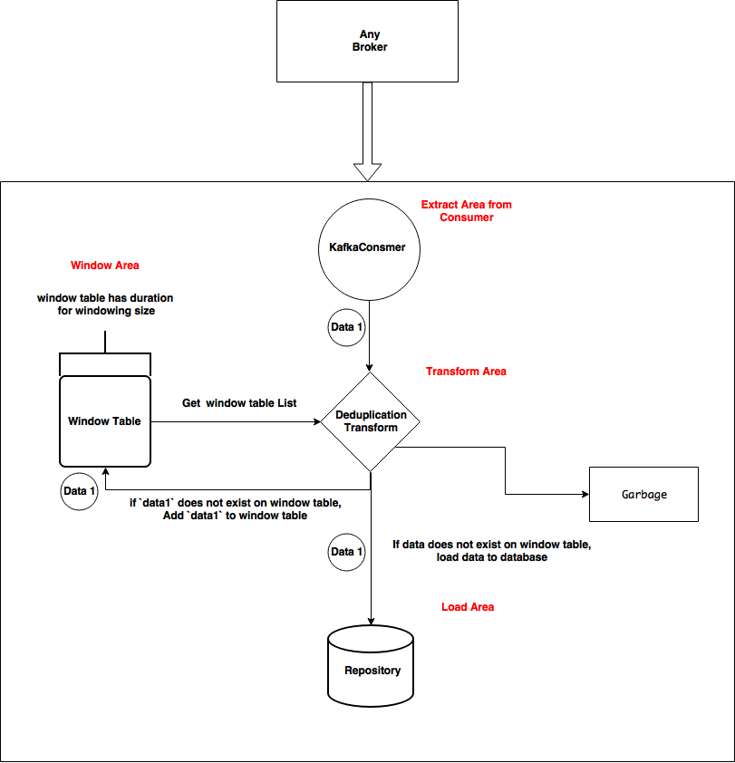
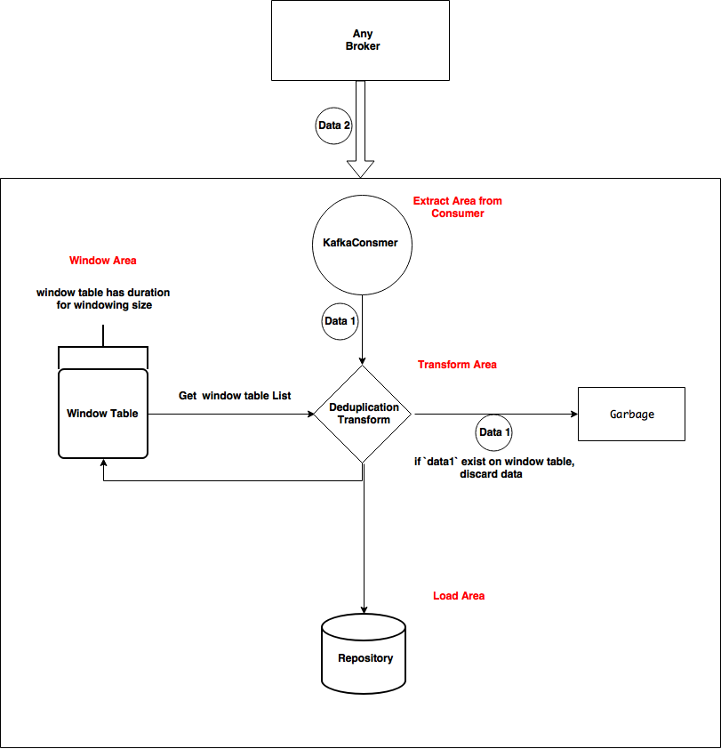

# etl-for-kafka


## How to Run

- Set up Database information `config.properties`
```
mysql.host =jdbc:mysql://127.0.0.1:3306
mysql.dbname =event
mysql.username =admin
mysql.password =password
```

- For local testing, run docker-compose up.
```
docker-compose up
```

## About Components

- Consumer Setting

we can now set the `Kafka consumer`. However, if you want, you can also create other consumers to match the consumer interface.

- Transform Setting

we can now set the `DeduplicationTransForm`. It filters duplicate data based on the key value.
If you keep the Transform interface, you can add a variety of transforms.

- Window Setting

we can now set the `EventSlidingWindow`. It is a moving window with duration.

- Output Setting

This is the target database to load the data into. It currently supports `Mysql`.

## Example Pipeline
```
new StreamContext
      .StreamContextBuilder()
      .setConsumer(new KafkaConsumerImpl.KafkaConsumerBuilder(topics).build())
      .setTransform(new DeduplicationTransForm(filterByKeys, targetWindow))
      .setWindow(new EventSlidingWindow(TEN_MINUTE))
      .setOutput(new EventMySqlRepository())
      .startPipeline();
```

## SERVICE FLOW 1. No duplicate data for 10 minutes


## SERVCE FLOW 2. Duplicate data case for 10 minutes



